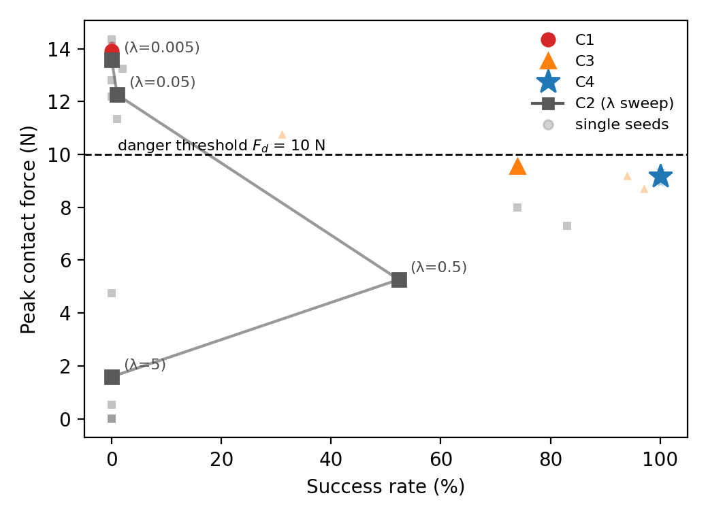

# Safety mechanisms for robot-assisted feeding (RL)

Research code for a paper comparing four safety mechanisms on a bite-transfer
task: a Kinova Gen3 arm feeds an SMPL-X human model in
[RCareWorld](https://github.com/empriselab/RCareWorld)/Unity, trained with
PPO. The four conditions share everything — environment, contact model,
reward shape, PPO hyperparameters, seeds, evaluation protocol — except the
mechanism itself:

| | mechanism | when it acts |
|---|---|---|
| **C1** | none (unconstrained) | — |
| **C2** | reward penalty, swept over λ | during training only |
| **C3** | reactive shield: retract once the force exceeds a trigger | after the danger threshold is crossed |
| **C4** | **predictive shield (proposed):** predict the contact force from the action and the analytic Jacobian, and slow/back off just enough to stay safe | before the danger threshold is reached |

## Headline result

100 deterministic evaluation episodes per seed, 3 seeds, mean ± sample std
(full numbers, tables and the figure below are generated by
[`make_paper_results.py`](make_paper_results.py) into
[`results/paper/`](results/paper/)):

| condition | success % (per seed) | peak force (N) | steps > danger threshold (%) | intervention (%) |
|---|---|---|---|---|
| C1 | 0 (0/0/0) | 13.91 ± 0.39 | 73.1 ± 1.7 | 0 |
| C2 (best λ = 0.5) | 52.3 (0/74/83) | 5.27 ± 4.13 | 0.9 ± 1.0 | 0 |
| C3 | 74.0 (31/94/97) | 9.57 ± 1.08 | 1.1 ± 1.4 | 3.3 ± 1.7 |
| **C4** | **100 (100/100/100)** | **9.17 ± 0.24** | **0** | 90.3 ± 1.8 |



C4 lies outside the trade-off curve traced by C2's penalty sweep: no penalty
weight reaches C4's success rate at a force below the danger threshold. See
[`results/paper/results_section_draft.md`](results/paper/results_section_draft.md)
for the full write-up, including the ablation over the shield's design
(retreat direction, robust margin — [§ Documentation](#documentation) below).

## Repository layout

```
feeding_env.py            thin wrapper over RCareWorld (robot/mouth/food/person, spoon attach)
feeding_task_env.py       Gym environment: observation, action, reward, contact model, metrics
safety.py                 the four mechanisms C1-C4 (see its docstrings for the full design history)
kinematics.py             analytic FK/Jacobian of the spoon tip, from the robot URDF
gen3_kinematics_only.urdf mesh-stripped URDF used only for kinematics

calibrate_pose.py         visual calibration of face direction / spoon axes
diag_approach.py          retreat-path approach-direction diagnostic
check_reachability_v2.py  reachability probing (see CLAUDE.md for its known caveats)

train_short.py            short sanity-check training runs -> models/short/, results/short/
train_eval.py              paper-scale training, evaluation, run planning, results aggregation
make_paper_results.py     paper tables, trade-off figure and numbers -> results/paper/

models/                   trained policies + VecNormalize statistics
results/                  evaluation results, logs, and results/paper/ (camera-ready outputs)
snapshots/                full code snapshots taken at major design pivots (see PROJECT_ARCHIVE.md)
```

## Documentation

Three documents, three purposes — read them in this order depending on what
you need:

1. **[`CLAUDE.md`](CLAUDE.md)** — reference. Verified, sometimes
   counter-intuitive platform behaviour (actuation, reset, kinematics,
   collisions), the current task/reward design, and a file-by-file map. Read
   this before changing any code.
2. **[`FUTURE_WORK.md`](FUTURE_WORK.md)** — forward-looking. Known
   simplifications kept deliberately for this paper (the contact force is a
   modelled proxy, not the physics engine's real contact force; only 3 seeds;
   no margin-sensitivity sweep yet) and options for the planned, larger
   rebuild of this project for another venue.
3. **[`PROJECT_ARCHIVE.md`](PROJECT_ARCHIVE.md)** — backward-looking. A full
   chronological record of the project: every decision, every option that was
   considered *and rejected* with the reasoning and data behind it (e.g. why
   the predictive shield scales the action instead of projecting it, why
   retreats are horizontal, why a robust margin is principled rather than
   result-shaping, why a failing random seed was fixed and rerun rather than
   dropped). Kept mainly so the options not taken here are available as a
   starting point for future extensions.

## Setup

```bash
# Simulator (public repos, not part of this project)
git clone https://github.com/empriselab/RCareWorld
git clone https://github.com/empriselab/RCareUnity      # only if you need to rebuild the Unity scene

# Environment
conda create -n rcareworld python=3.10
conda activate rcareworld
pip install -e RCareWorld/pyrcareworld                  # pyrcareworld is not on PyPI
pip install -r requirements.txt
```

The Unity player build (`FeedingBuild/`) is not committed here (~2 GB of
binaries). Build it from `RCareUnity`'s
`Assets/RCareCommon/Example Scenes/Feeding.unity` scene (see
[`CLAUDE.md`](CLAUDE.md), "Face collisions", for the exact collider/layer
setup this project relies on), and point
`feeding_env.py:_DEFAULT_EXECUTABLE_PATH` at the resulting executable.

## Usage

```bash
# Calibrate references visually (face direction, spoon axes) and confirm by watching the GUI
python calibrate_pose.py --only 1 3 6 --hold-scale 4 --time-scale 2

# Quick sanity-check training (writes to models/short/, results/short/ only)
python train_short.py --condition C4 --steps 100000

# One paper-scale training + evaluation run
python train_eval.py train --condition C4 --seed 0 --steps 400000
python train_eval.py eval  --condition C4 --seed 0 --episodes 100

# Print every command needed for the full grid, aggregate finished runs
python train_eval.py plan
python train_eval.py report

# Rebuild the paper's tables, figure and numbers from results/*.json
python make_paper_results.py
```

## License

See [`LICENSE`](LICENSE).
